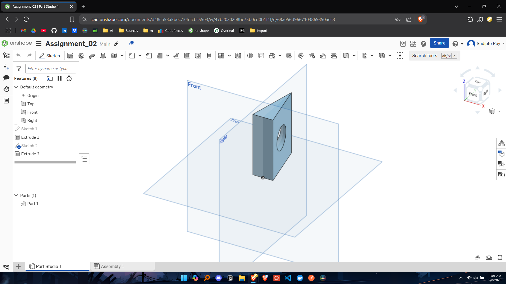
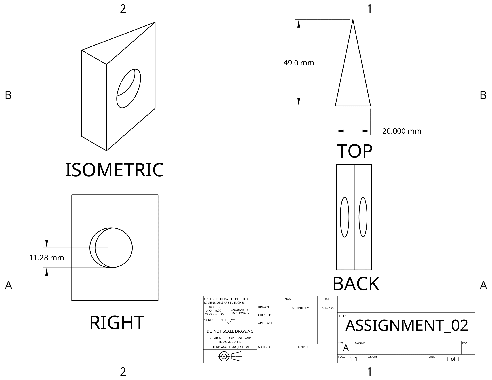

# 🛠️ EEE154 (Engineering Drawing) – Assignment 02

## ❓ Question
```
You are required to draw the following object in onshape:

1. Draw an isosceles triangle with sides 5, 5, and 2 cm
2. Extrude this triangle to make a 3D triangular block of depth 6 cm
3. Make a hole of depth 3 cm through one of the 5 cm slanted edges.
```

## 📌 Assignment Highlights

- Create a 3D model with accurate dimensions and constraints.
- Extrude a 2D isosceles triangle into a 3D triangular block.
- Add a precise hole feature through a slanted edge.

## 🔗 Onshape Model

[🔗 View Onshape Model](https://cad.onshape.com/documents/d48cb53a5bec734efcbc55e3/w/47b20a02e8bc75b0cd0b1f1f/e/68ae56d9667103869350aec8?renderMode=0&uiState=681c5eb83c4d656073c3dc81)

## 🖼️ Screenshots

### Onshape Workspace →


### 3D Drawing View →


---

For any questions or clarifications, feel free to reach out:  
📧 **royshawonsudipto@gmail.com**
