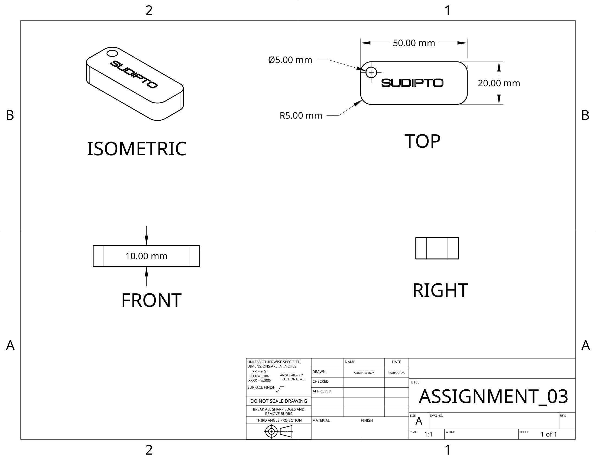

# 🛠️ EEE154 (Engineering Drawing) – Assignment 03

## ❓ Question
```
You are required to build a 3D keychain using onshape

Here are the instructions -
1. Draw a rectangle (50 mm by 20 mm)
2. Fillet the corners with a radius of 5mm
3. Depth of the block should be 10 mm
4. Add a hole of diameter 5mm at one of the corners
5. Engrave your name or initials with a depth of 2 mm
```

## 📌 Assignment Highlights

- Create a 3D keychain with realistic dimensions and fillets.
- Add a circular hole for attachment.
- Engrave name or initial using extrusion cut.
- Ensure correct depth and material removal techniques.

## 🔗 Onshape Model

[🔗 View Onshape Model](https://cad.onshape.com/documents/example-link-assignment03)

> *Replace the above link with the actual Assignment 03 Onshape URL.*

## 🖼️ Screenshots

### Onshape Workspace →


### 3D Drawing View →


---

For any questions or clarifications, feel free to reach out:  
📧 **royshawonsudipto@gmail.com**
