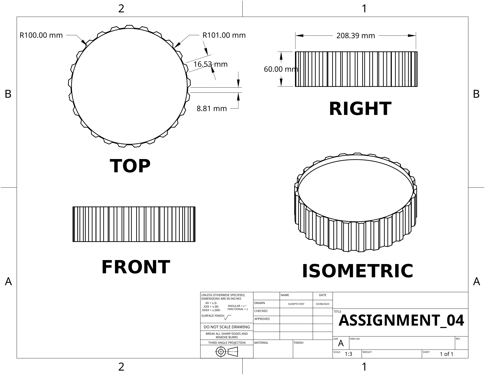

# 🛠️ EEE154 (Engineering Drawing) – Assignment 04

## ❓ Question
```
Draw a gear with 25 tooth around, internal radius of 10 cm and an internal thickness of 5 cm and external thickness of 6 cm.

You should submit a pdf of the drawing displaying the top, right, front and isometric view with all important dimensions labelled.
```

## 📌 Assignment Highlights

- Design a gear with 25 uniformly spaced teeth.
- Set internal radius to 10 cm and control two thickness layers.
- Maintain accurate dimensions and gear symmetry.
- Generate and dimension Top, Front, Right Side, and Isometric views in the final drawing.

## 🔗 Onshape Model

[🔗 View Onshape Model](https://cad.onshape.com/documents/example-link-assignment04)

> *Replace the above link with the actual Assignment 04 Onshape URL.*

## 🖼️ Screenshots

### Onshape Workspace →


### 3D Drawing View →


---

For any questions or clarifications, feel free to reach out:  
📧 **royshawonsudipto@gmail.com**

