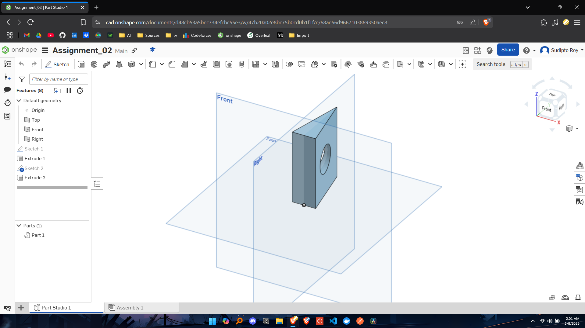

# 📐 EEE154 (Engineering Drawing) – Assignments Repository

Welcome to the **EEE154 Engineering Drawing** assignments repository! This repository contains all the resources, instructions, and outputs for the assignments completed as part of the course.

---

## 📂 Repository Structure

The repository is organized into folders, each corresponding to a specific assignment:
```
├── Assignment_01/ 
├── Assignment_02/ 
├── Assignment_03/ 
├── Assignment_04/ 
└── README.md
```

### Key Files:
- **Assignment_X.txt**: Contains the assignment instructions.
- **README.md**: Detailed description of the assignment, including highlights, questions, and links to the Onshape models.
- **Screenshots**: Visual representations of the 3D models and drawing views.

---

## 📌 Assignments Overview

### Assignment 01: Rectangle with Constant Diagonal

- **Objective**: Draw a rectangle with a constant diagonal of 7.1 inches and a width of more than 4 inches.
- **Highlights**:
  - Create a 3D model with accurate dimensions.
  - Generate Top, Front, Right Side, and Isometric views.
- **Onshape Model**: [🔗 View Onshape Model](https://cad.onshape.com/documents/06c5b6a55a3c2dc9bea669dd/w/fd5180b6b89e64f69b92b3a6/e/a407f0f2f61d91c0b59a86c9?renderMode=0&uiState=6818ff1e4fca36542a1c1075)

---

### Assignment 02: Isosceles Triangle Extrusion

- **Objective**: Draw an isosceles triangle and extrude it into a 3D triangular block.
- **Highlights**:
  - Create a 3D model with accurate dimensions and constraints.
  - Add a precise hole feature through a slanted edge.
- **Onshape Model**: [🔗 View Onshape Model](https://cad.onshape.com/documents/d48cb53a5bec734efcbc55e3/w/47b20a02e8bc75b0cd0b1f1f/e/68ae56d9667103869350aec8?renderMode=0&uiState=681c5eb83c4d656073c3dc81)

---

### Assignment 03: 3D Keychain with Engravings

- **Objective**: Build a 3D keychain with realistic dimensions and engravings.
- **Highlights**:
  - Create a 3D keychain with filleted corners and a circular hole.
  - Engrave initials or a name using extrusion cut.
- **Onshape Model**: [🔗 View Onshape Model](https://cad.onshape.com/documents/80f3d6e360814f36d23216f9/w/04c65762aab844773bc28a5c/e/99678701e165ac79a684d1d3?renderMode=0&uiState=681d00782dcd881bdedea6e3)

---

### Assignment 04: Gear Design

- **Objective**: Design a gear with 25 teeth, an internal radius of 10 cm, and two thickness layers.
- **Highlights**:
  - Create a gear with accurate dimensions and symmetry.
  - Generate Top, Front, Right Side, and Isometric views with labeled dimensions.
- **Onshape Model**: [🔗 View Onshape Model](https://cad.onshape.com/documents/92e540ffa2744e73eb102036/w/b81784054a6c4c4f84f7d40e/e/ed2628b6bdf3b75dda781a03?renderMode=0&uiState=681fa281f5246573111d014e)

---

## 🖼️ Screenshots

Each assignment folder contains:
- **Onshape Workspace Screenshot**: A snapshot of the Onshape workspace.
- **3D Drawing View Screenshot**: A detailed view of the 3D model.

---

## 🛠️ Tools Used
- **Onshape**: A cloud-based CAD software for creating 3D models.
- **File Organization**: Each assignment is organized into its own folder for clarity.

---

## 📧 Contact
For any questions or clarifications, feel free to reach out:  
📧 **royshawonsudipto@gmail.com**

---
